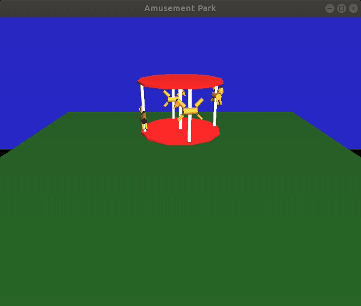

### Simulation of an Amusement Park

This is a practice exercise for simulations in OpenGL. All code is written in C. The running instructions are specified below - 

* To build the code - ```make```
* To run the simulation - ```./Simulation```
* To remove generated files - ```make clean```

